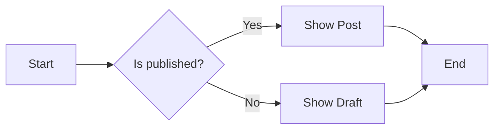
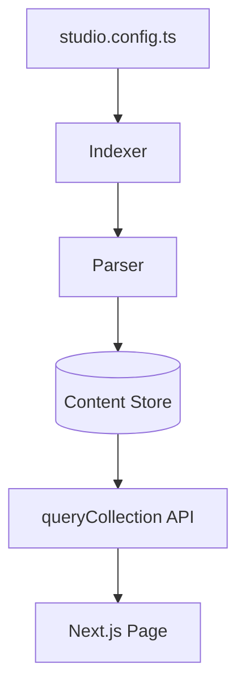
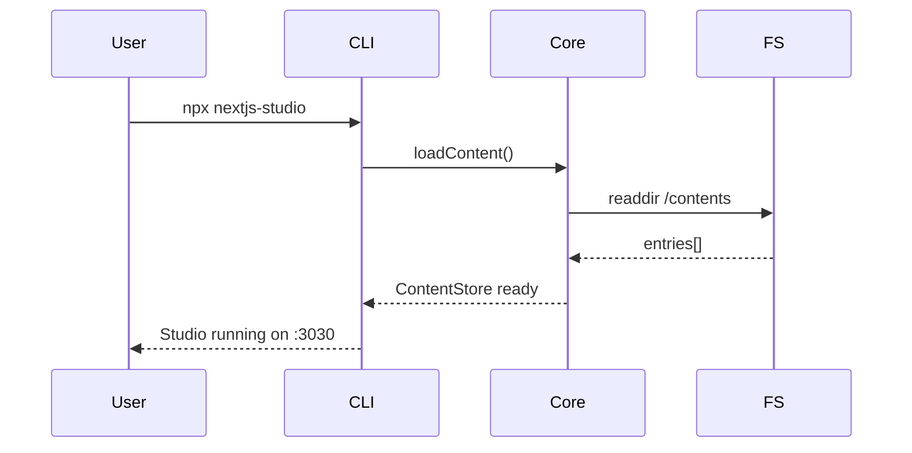
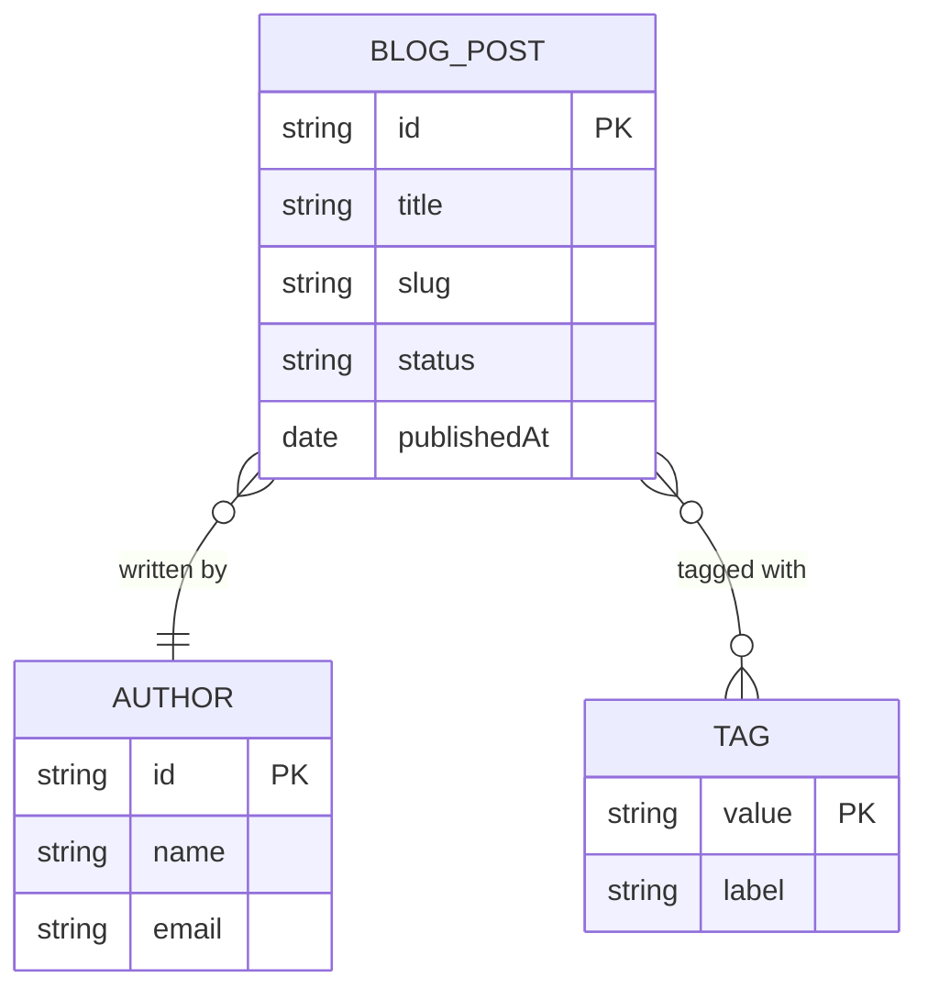
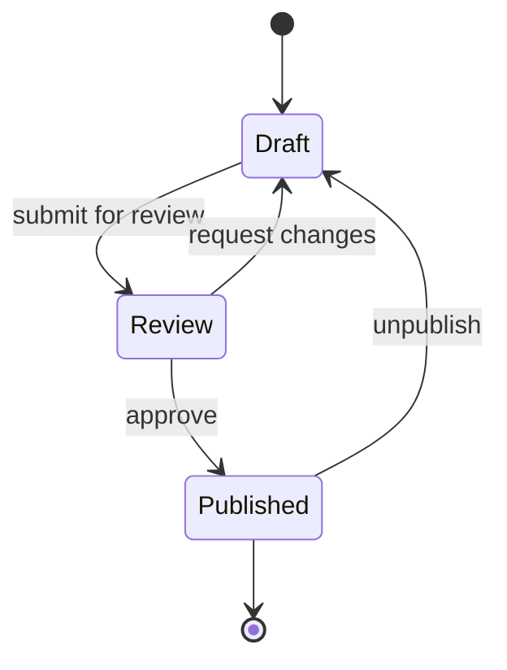

# H1 — All Fields & Features Test

## H2 — Text Formatting

### H3 — Inline Styles

This is **bold text**, this is *italic text*, this is ~~strikethrough~~ text, and this is `inline code`.

Here is a [link to example.com](https://example.com) and another [internal link](/blog/getting-started).

---

## H2 — Media


---

## H2 — Components

<CTA
  title="Get Started Now"
  href="https://example.com/get-started"
  variant="primary"
/>

<Hero
  title="Welcome to the Studio"
  subtitle="A local-first CMS for Next.js"
  image="/screenshot.png"
  centered={true}
/>

---

## H2 — Mermaid Diagrams

### H3 — Flowchart (LR)



### H3 — Flowchart (TD)



### H3 — Sequence Diagram



### H3 — Entity Relationship



### H3 — State Diagram



---

## H2 — Code Block

```typescript
import { queryCollection } from 'nextjs-studio/server'

const posts = await queryCollection('blog')
  .where({ published: true })
  .sort('date', 'desc')
  .limit(10)
  .all()

for (const post of posts) {
  console.log(post.title, post.slug)
}
```
